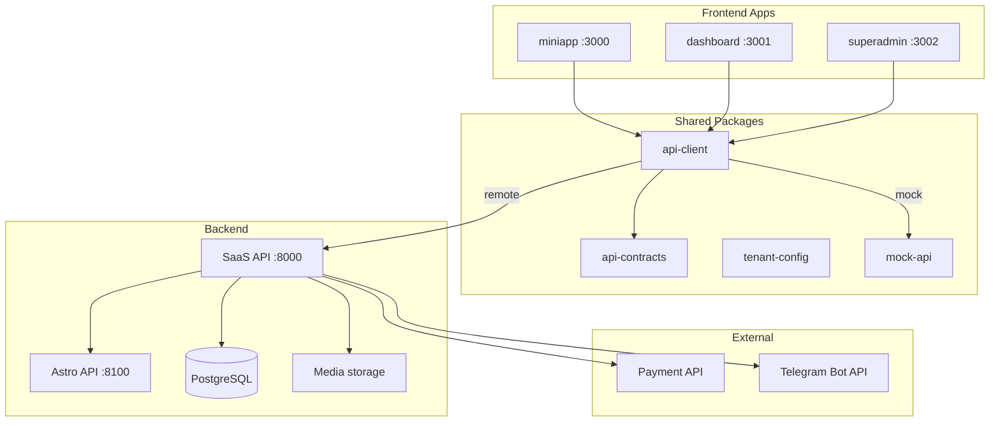

# Архитектура платформы

Полная архитектура Astro Platform: сервисы, границы, auth, данные.

---

## Диаграмма сервисов

---

## Границы ответственности

| Компонент | Ответственность |
|-----------|-----------------|
| **Frontend apps** | UI, routing, вызов SaaS API через api-client |
| **SaaS API** | Auth, tenants, config, checkout, orders, entitlements, finance, public surfaces, Telegram orchestration |
| **Astro API** | Астрологические расчёты, генерация Report Schema V2 |
| **Payment API** | Интеграция с платёжным провайдером |
| **Telegram Bot API** | Валидация bot token, webhook (setup) |

Frontend **никогда** не вызывает Astro API, Payment API или Telegram Bot API напрямую.

---

## Auth: два namespace

| Namespace | Cookie | Endpoints | Пользователи |
|-----------|--------|-----------|--------------|
| Dashboard auth | `saas_session` | `/auth/login`, `/auth/logout`, `/auth/me` | platform_admin, creator, viewer |
| End-user auth | `saas_end_user_session` | `/api/me`, `/api/reports/*`, checkout, entitlements | Mini app users |

Telegram Mini App auth: `POST /api/telegram/validate-init-data` → end-user session.

---

## Multi-surface publishing

Creator настраивает mini-app в Launch Studio и включает поверхности:

1. **website** — публичный URL на web
2. **mobile_web** — mobile-optimized web
3. **telegram_mini_app** — требует подключённый bot token

Каждая поверхность имеет slug, enabled flag, publish state. Public resolver: `GET /api/public/surfaces/{type}/{slug}`.

---

## Draft / publish model

Tenant config и creator mini-app хранят `{ draft, published }`:

- Dashboard редактирует **draft**
- `POST .../publish` — promotes draft → published
- Public surfaces отдают **published** config
- Preview draft: `?preview=draft` (dashboard embedded preview; public API rejects draft preview with 403)

---

## Checkout / payment / entitlement flow

1. Frontend: `POST /api/checkout/start` с `productId`, `productType` (без price)
2. SaaS: resolve price from approved catalog
3. SaaS → Payment API: create payment session
4. Frontend: redirect to `paymentUrl`
5. Return page: `POST /api/checkout/{orderId}/confirm-return`
6. SaaS → Payment API: verify status
7. If paid: entitlement + `POST /v1/reports/paid` → Astro API
8. User access: `GET /api/me/reports/{id}/access`

---

## Finance

Append-only ledger. Lifecycle:

Payment → LedgerEntry → Commission → PartnerBalance (pending) → release → available → manual Payout

См. [COMMERCE_LEDGER.md](./COMMERCE_LEDGER.md).

---

## Report Schema V2

- `schemaVersion: 2`
- Sections, actions, localized content
- V1 fields (`summary`, `highlights`, `lockedSections`) — deprecated

См. [ASTRO_API_CONTRACT.md](./ASTRO_API_CONTRACT.md).

---

## Хранилища

| Store | Назначение |
|-------|------------|
| PostgreSQL | Tenants, configs, orders, payments, entitlements, reports, partners, commissions, ledger, payouts |
| Local/S3 media | Tenant media assets (`MEDIA_STORAGE_PROVIDER`) |
| Encrypted refs | Telegram bot tokens (`TELEGRAM_TOKEN_ENCRYPTION_KEY`) |

---

## Production checks

`services/backend-common/src/backend_common/production_checks.py`:

- Production forbids `PAYMENT_API_MODE=mock`, `ASTRO_API_MODE=mock`
- Remote mode requires `*_BASE_URL`; production requires `*_TOKEN`
- Staging mocks require `ALLOW_STAGING_MOCKS=true`

---

## Связанные документы

- [FRONTEND_BACKEND_CONNECTION.md](./FRONTEND_BACKEND_CONNECTION.md)
- [PUBLIC_SURFACES.md](./PUBLIC_SURFACES.md)
- [TELEGRAM_BOT_INTEGRATION.md](./TELEGRAM_BOT_INTEGRATION.md)
- [INTEGRATIONS.md](./INTEGRATIONS.md)
