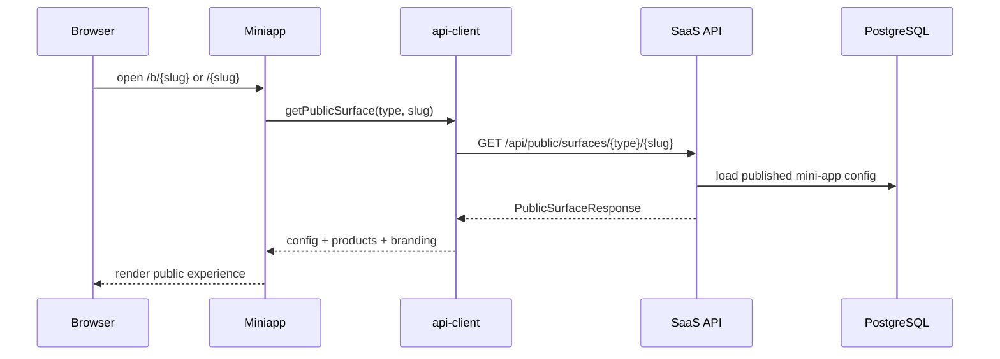
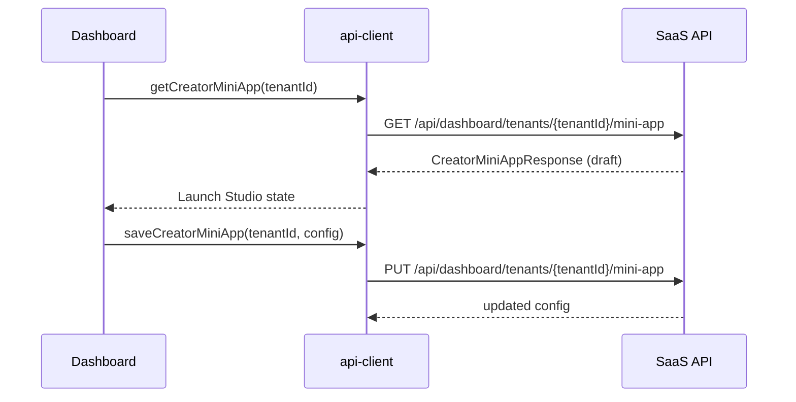
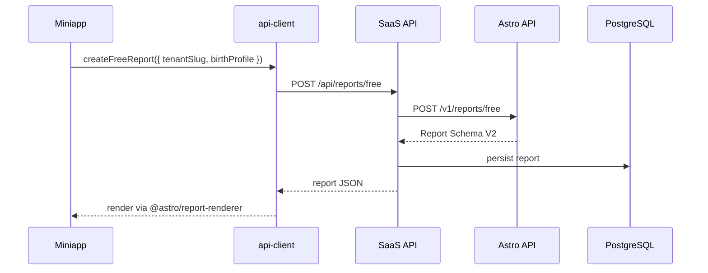
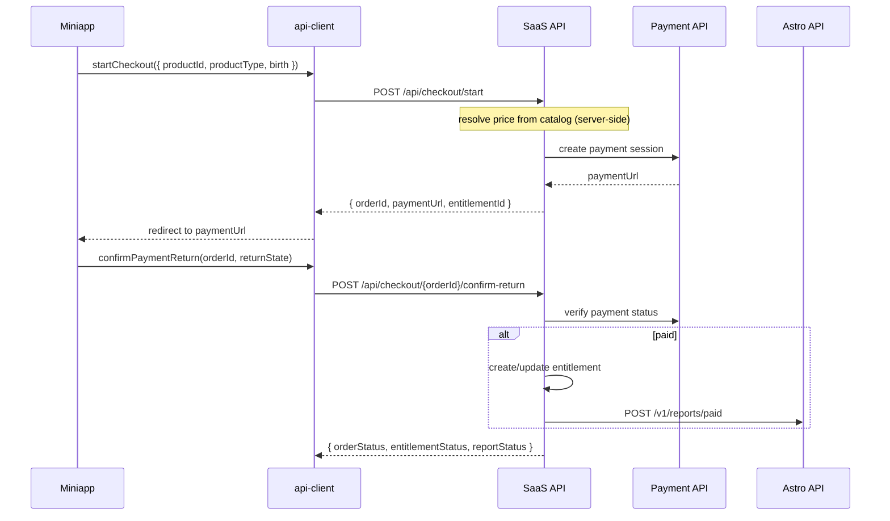
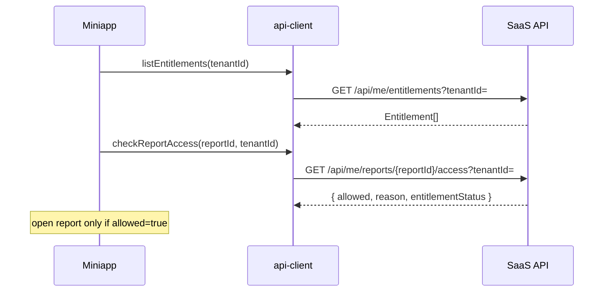
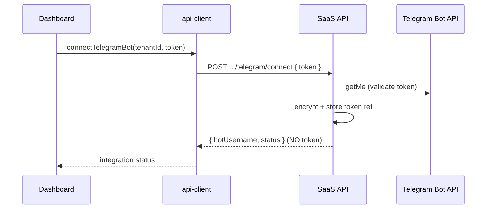

# Связь Frontend ↔ Backend

Главный handoff-документ для frontend-, backend- и интеграционных разработчиков.

**Связанные документы:** [ARCHITECTURE.md](./ARCHITECTURE.md) · [API_CONTRACTS.md](./API_CONTRACTS.md) · [ENVIRONMENT_VARIABLES.md](./ENVIRONMENT_VARIABLES.md)

---

## 1. Обзор

```
Browser (miniapp / dashboard / superadmin)
    → @astro/api-client (mock | remote adapter)
        → SaaS API :8000
            → Astro API :8100
            → Payment API (external)
            → Telegram Bot API
```

**Правило:** браузер вызывает **только SaaS API**. Astro API, Payment API и Telegram Bot API — server-side интеграции SaaS API.

---

## 2. Режимы runtime

### Frontend

| Переменная | Значения | По умолчанию |
|------------|----------|--------------|
| `NEXT_PUBLIC_API_MODE` | `mock` \| `remote` | `mock` |
| `NEXT_PUBLIC_API_BASE_URL` | URL SaaS API | пусто |

Реализация: `packages/api-client/src/config.ts`

### Mock mode (`NEXT_PUBLIC_API_MODE=mock`)

- Frontend использует `@astro/mock-api` через `@astro/api-client`
- Backend **не требуется**
- Подходит для UI-разработки, демо, быстрого прототипирования
- Auth bypass: dashboard/superadmin автоматически «авторизованы»; miniapp использует синтетические user ID
- Checkout/payment orchestration — in-memory через `packages/api-client/src/services/order-lifecycle.ts`
- В UI показывается `MockModeBanner`

### Remote mode (`NEXT_PUBLIC_API_MODE=remote`)

- Frontend вызывает SaaS API по `NEXT_PUBLIC_API_BASE_URL`
- Браузер использует **только** public `NEXT_PUBLIC_*` env
- Запросы с `credentials: "include"` для session cookies
- Если base URL пуст — ошибка `REMOTE_API_NOT_CONFIGURED` (fail-fast)
- Miniapp: реальная валидация Telegram `initData` (или dev bypass на SaaS API)
- Dashboard/Superadmin: login через `/auth/login`

---

## 3. Frontend-приложения

| App | Порт | Package | Назначение |
|-----|------|---------|------------|
| `apps/miniapp` | 3000 | `@astro/miniapp` | Публичный опыт end-user (все поверхности) |
| `apps/dashboard` | 3001 | `@astro/dashboard` | Creator Dashboard, Launch Studio, ops/finance |
| `apps/superadmin` | 3002 | `@astro/superadmin` | Platform admin — tenants, health, audit |

### apps/miniapp — ключевые endpoints

| Действие | Endpoint |
|----------|----------|
| Загрузка public surface / tenant config | `GET /api/public/surfaces/{type}/{slug}`, `GET /api/tenant/{slug}/config` |
| Telegram auth | `POST /api/telegram/validate-init-data` |
| Birth profile | `GET/POST /api/me/birth-profile` |
| Free report | `POST /api/reports/free` |
| Reports list/detail | `GET /api/reports`, `GET /api/reports/{id}` |
| Checkout | `POST /api/checkout/start`, `GET /api/checkout/{orderId}`, `POST .../confirm-return` |
| Entitlements | `GET /api/me/entitlements`, `GET /api/me/reports/{id}/access` |
| Premium request | `POST /api/me/premium-requests` |
| Analytics | `POST /api/analytics/events` |

Auth: end-user session cookie (`END_USER_COOKIE_NAME`, default `saas_end_user_session`).

### apps/dashboard — ключевые endpoints

| Действие | Endpoint |
|----------|----------|
| Login/logout | `POST /auth/login`, `POST /auth/logout`, `GET /auth/me` |
| Tenant config draft/publish | `GET/PUT .../config/draft`, `POST .../publish` |
| Creator mini-app | `GET/PUT /api/dashboard/tenants/{id}/mini-app` |
| Surfaces | `PUT .../surfaces/{surfaceId}`, `PUT .../mini-app/surfaces/{type}/enabled` |
| Telegram connect | `POST .../telegram/connect`, `GET .../telegram/status` |
| Ops (orders, finance) | `/api/dashboard/tenants/{id}/ops/*` |
| Media | `POST/GET/DELETE .../media` |

Auth: account session cookie (`SAAS_COOKIE_NAME`, default `saas_session`).

### apps/superadmin

Те же endpoints что dashboard + admin-only:
- `GET /api/admin/tenants/{id}/health`
- `GET /api/admin/audit-logs`
- Mock payment approval, entitlement revoke/unlock (platform_admin)

Role gate: `platform_owner` или `platform_admin` через `/auth/me`.

### Выбор mock/remote

Все три app импортируют функции из `@astro/api-client`:

```typescript
import { getTenantConfig, startCheckout, getApiMode } from "@astro/api-client";
```

`getApiMode()` читает `NEXT_PUBLIC_API_MODE`. Adapter выбирается в `packages/api-client/src/client.ts`.

---

## 4. Backend-сервисы

| Сервис | Порт | Назначение |
|--------|------|------------|
| `services/saas-api` | 8000 | Platform API — единственная точка для frontend |
| `services/astro-api` | 8100 | Генерация отчётов (internal) |
| Payment API | external | Платёжный провайдер (external/internal service) |
| Telegram Bot API | external | Валидация bot token, webhook setup |

---

## 5. Диаграммы потоков данных

### A. Загрузка public surface



Альтернативные legacy endpoints (совместимость):
- `GET /api/public/partners/{slug}`
- `GET /api/public/miniapps/{slug}`

### B. Dashboard builder / Launch Studio



Publish: `POST .../mini-app/publish` — draft → published snapshot.

### C. Free report



Поле места рождения: **`birthPlace`** (не `birthCity`).

### D. Paid checkout



**Frontend НЕ отправляет:** `amount`, `currency`, `productTitle`, `price`, `commission`.

### E. Entitlement access



### F. Telegram bot connect



Token **никогда** не возвращается frontend.

### G. Finance lifecycle

```mermaid
flowchart LR
  PaymentPaid[Payment paid] --> PaymentRecord[Payment record]
  PaymentRecord --> LedgerEntry[Ledger entries]
  LedgerEntry --> Commission[Commission accrual]
  Commission --> PendingBalance[PartnerBalance pending]
  PendingBalance --> Release[Manual release after hold]
  Release --> AvailableBalance[Available balance]
  AvailableBalance --> Payout[Manual payout]
```



Hold period: `COMMISSION_HOLD_DAYS` (default 7). См. [COMMERCE_LEDGER.md](./COMMERCE_LEDGER.md).

---

## 6. Правила безопасности

| Правило | Детали |
|---------|--------|
| Frontend не получает backend secrets | `ASTRO_API_TOKEN`, `PAYMENT_API_TOKEN`, Telegram bot token — только на SaaS API |
| Frontend не отправляет trusted pricing | Checkout request: только `productId`, `productType`, `birth` — без `amount`/`currency`/`price` |
| Frontend не помечает payment as paid | Только SaaS API после verify через Payment API |
| Return URL ≠ unlock | `confirm-return` проверяет статус на сервере; entitlement server-side |
| Entitlement access server-side | `GET /api/me/reports/{id}/access` — единственный gate |
| Telegram token не возвращается | Connect возвращает только bot info/status |
| Два namespace auth | `/auth/*` — dashboard accounts; `/api/me/*` — end users |

---

## 7. Локальная настройка

### Mock-only (frontend)

```bash
pnpm install
cp .env.example .env.local
pnpm dev
```

### Full stack (remote)

```bash
bash scripts/setup-backend-venv.sh
pnpm db:migrate:saas && pnpm db:seed:saas

# .env.local
NEXT_PUBLIC_API_MODE=remote
NEXT_PUBLIC_API_BASE_URL=http://localhost:8000

# .env (SaaS API — см. .env.example)
ALLOW_DEV_TELEGRAM_AUTH=true
ASTRO_API_BASE_URL=http://localhost:8100
PAYMENT_API_MODE=mock

pnpm dev:backend
pnpm dev
```

| App | URL |
|-----|-----|
| Miniapp | http://localhost:3000 |
| Dashboard | http://localhost:3001/login |
| Superadmin | http://localhost:3002/login |
| SaaS API docs | http://localhost:8000/docs |
| Astro API | http://localhost:8100/health |

Health checks:

```bash
curl http://localhost:8000/health
curl http://localhost:8000/ready
curl http://localhost:8100/health
```

---

## 8. API envelope

Все ответы SaaS API:

```json
{
  "ok": true,
  "data": {},
  "meta": {
    "requestId": "...",
    "timestamp": "..."
  }
}
```

Ошибки:

```json
{
  "ok": false,
  "error": {
    "code": "VALIDATION_ERROR",
    "message": "..."
  },
  "meta": { "requestId": "..." }
}
```

---

## 9. CORS и cookies

- `CORS_ORIGINS` на SaaS API должен включать все три frontend origin (3000, 3001, 3002)
- Remote adapter использует `credentials: "include"`
- Production: `SAAS_COOKIE_SECURE=true`, корректный `SAAS_COOKIE_DOMAIN`
- End-user и account cookies — разные (`END_USER_COOKIE_NAME` vs `SAAS_COOKIE_NAME`)

---

## 10. Типичные ошибки

| Ошибка | Решение |
|--------|---------|
| `ASTRO_API_TOKEN` в `NEXT_PUBLIC_*` | Только server-side на SaaS API |
| Frontend вызывает Astro API :8100 напрямую | Всегда через SaaS API |
| Mock payment в production | Production forbids `PAYMENT_API_MODE=mock` |
| CORS errors | Добавить origin в `CORS_ORIGINS` |
| Cookies не сохраняются | `SameSite`, `Secure`, domain mismatch |
| `birthCity` вместо `birthPlace` | Использовать `birthPlace` в новых контрактах |
| Frontend отправляет `amount` в checkout | Только `productId` + `productType`; цена — server-side |
| Return URL открывает paid content без verify | Всегда вызывать `confirm-return` и проверять entitlement |
| Creator подключает свой payment processor | Нет — платформа принимает платежи централизованно |
| Ожидание auto payout в pilot | Выплаты только manual — см. payout runbook |

---

## 11. Ссылки на код

| Ресурс | Путь |
|--------|------|
| API mode config | `packages/api-client/src/config.ts` |
| Remote adapter | `packages/api-client/src/adapters/remote.ts` |
| Mock adapter | `packages/api-client/src/adapters/mock.ts` |
| Endpoint paths | `packages/api-contracts/src/endpoints.ts` |
| Checkout schema | `packages/api-contracts/src/integration/checkout.ts` |
| Product catalog | `packages/tenant-config/src/product-catalog.ts` |
| SaaS routes | `services/saas-api/src/saas_api/api/` |
