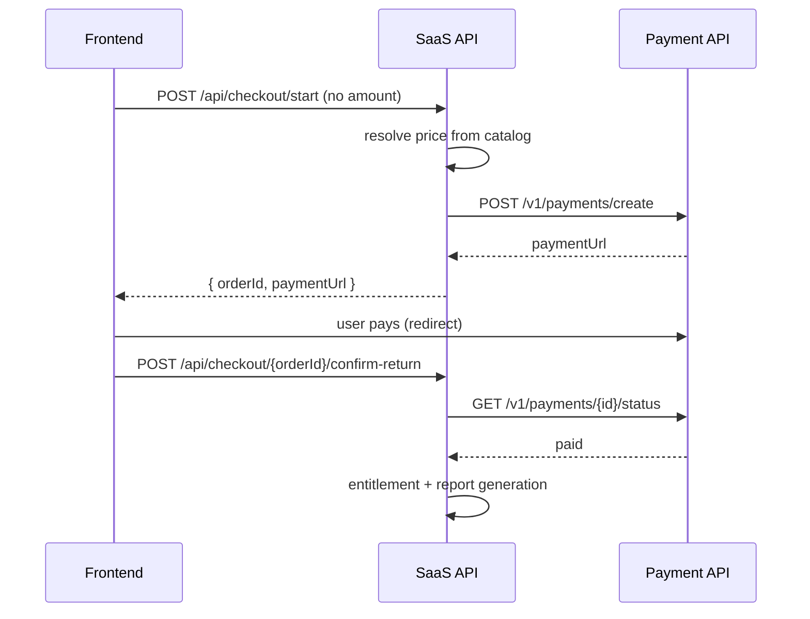

# Payment API Contract

External payment service — интеграция **только server-side** через SaaS API.

Frontend **никогда** не вызывает Payment API и не получает `PAYMENT_API_TOKEN`.

---

## Роль

| Компонент | Ответственность |
|-----------|-----------------|
| **Payment API** | Создание платежа, интеграция с провайдером, подтверждение статуса |
| **SaaS API** | Resolve price from catalog, create order, call Payment API, verify status, create entitlement |
| **Frontend** | `startCheckout` → redirect to `paymentUrl` → `confirm-return` |

Creators **не подключают** свои payment processors. Платформа принимает все платежи централизованно.

---

## Environment (SaaS API)

| Variable | Values | Notes |
|----------|--------|-------|
| `PAYMENT_API_MODE` | `mock` \| `remote` | Production forbids `mock` |
| `PAYMENT_API_BASE_URL` | URL | Required if remote |
| `PAYMENT_API_TOKEN` | secret | Required in production if remote |
| `PAYMENT_API_TIMEOUT_MS` | ms | Default 30000 |
| `ALLOW_STAGING_MOCKS` | `true`/`false` | Required for mock in staging |
| `MINIAPP_PUBLIC_BASE_URL` | URL | Payment return URL base |
| `PAYMENT_SUCCESS_PATH` | path | default `/payment/success` |
| `PAYMENT_CANCEL_PATH` | path | |
| `PAYMENT_PENDING_PATH` | path | |

Client: `services/saas-api/src/saas_api/services/payment_client.py`

---

## Endpoints (Payment API — external)

### POST `/v1/payments/create`

Called by SaaS with **server-resolved** amount/currency from catalog.

Request (snake_case):

```json
{
  "order_id": "ord_abc123",
  "tenant_id": "tenant_mystic",
  "user_id": "eu_abc123",
  "session_id": "eu_abc123",
  "product_type": "low_ticket_money",
  "product_title": "Денежный код",
  "amount": 29.0,
  "currency": "USD",
  "success_url": "https://app.example.com/mystic-dark/payment/success",
  "cancel_url": "https://app.example.com/mystic-dark/payment/cancel",
  "pending_url": "https://app.example.com/mystic-dark/payment/pending",
  "metadata": {
    "partner_id": "partner_nicole",
    "partner_slug": "nicole",
    "theme": "money",
    "locale": "ru"
  }
}
```

Response:

```json
{
  "payment_id": "pay_...",
  "payment_url": "https://provider.example.com/checkout/...",
  "status": "created"
}
```

### GET `/v1/payments/{payment_id}/status`

Response:

```json
{
  "payment_id": "pay_...",
  "order_id": "ord_...",
  "status": "paid",
  "paid_at": "2026-05-25T10:00:00.000Z",
  "amount": 29.0,
  "currency": "USD",
  "error_code": null,
  "error_message": null
}
```

Status values: `created`, `pending`, `paid`, `failed`, `cancelled`, `refunded`

### GET `/v1/orders/{order_id}/payment-status`

Alternative sync endpoint — same response shape as payment status.

---

## Mock mode

When `PAYMENT_API_MODE=mock`:

- SaaS generates mock `paymentUrl` pointing to miniapp return routes
- Query params: `orderId`, `paymentId`, `mock=pending|success|cancel|failed`
- Admin can approve via `POST .../ops/orders/{id}/approve-mock-payment` (platform_admin only)
- Staging mock requires `ALLOW_STAGING_MOCKS=true`

Mock payment URL example:

```
http://localhost:3000/mystic-dark/payment/pending?orderId=ord_...&paymentId=pay_...&mock=pending
```

---

## Platform checkout flow



**Critical:** return URL alone does not unlock content. Always verify via `confirm-return`.

---

## Security

- `PAYMENT_API_TOKEN` — server-only, never `NEXT_PUBLIC_*`
- Frontend checkout request must not include trusted pricing fields
- Amount/currency determined by SaaS from approved catalog at checkout time

---

## Not implemented (pilot)

- Real provider webhooks (Payment API may poll/status only)
- Creator-connected Stripe accounts
- Automatic payouts to creators

Manual payouts: [CLOSED_PILOT_PAYOUT_RUNBOOK.md](./CLOSED_PILOT_PAYOUT_RUNBOOK.md)

---

## Related

- [SAAS_API_CONTRACT.md](./SAAS_API_CONTRACT.md) — checkout endpoints
- [INTEGRATIONS.md](./INTEGRATIONS.md)
- [COMMERCE_LEDGER.md](./COMMERCE_LEDGER.md)
