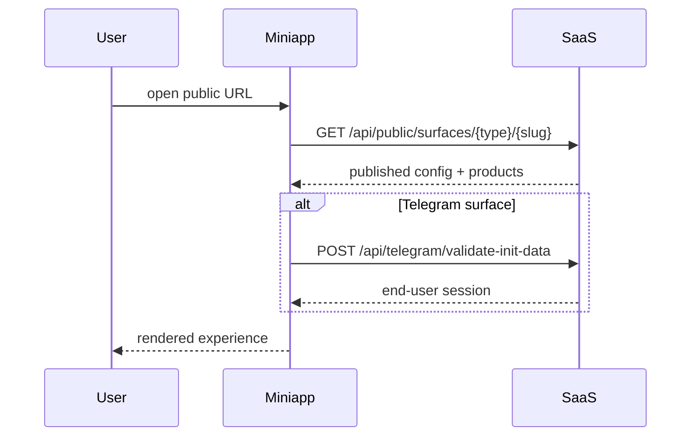

# Публичные поверхности (Public Surfaces)

Маршрутизация и загрузка публичного опыта end-user на Website, Mobile Web и Telegram Mini App.

**App:** `apps/miniapp` (port 3000)

---

## Типы поверхностей

| surfaceType | Описание | Требования |
|-------------|----------|------------|
| `website` | Desktop/mobile web site | Published config |
| `mobile_web` | Mobile-optimized web | Published config |
| `telegram_mini_app` | Telegram Mini App | Published config + connected bot |

---

## Primary resolver

```
GET /api/public/surfaces/{surface_type}/{slug}
```

**Path params:**
- `surface_type`: в API path используются shorthand `telegram`, `website`, `mobile` (см. `endpoints.ts`)
- В contract schema: `telegram_mini_app`, `website`, `mobile_web`

**Response:** `PublicSurfaceResponse` — branding, products, partner info, surface config.

---

## Legacy aliases (совместимость)

| Endpoint | Назначение |
|----------|------------|
| `GET /api/public/partners/{slug}` | Resolve partner + mini-app by slug |
| `GET /api/public/miniapps/{slug}` | Alias — тот же resolver |

Оба endpoint вызывают один и тот же service.

---

## Tenant config endpoints

| Endpoint | Назначение |
|----------|------------|
| `GET /api/tenant/{slug}/config` | Published tenant config |
| `GET /api/tenant/{slug}/config/published` | Explicit published |
| `GET /api/tenant/{slug}/products` | Product list |
| `GET /api/tenant/{slug}/products/{productId}` | Single product |

**Note:** `?preview=draft` на public API — **403 Forbidden**. Draft preview только через dashboard embedded preview.

---

## Frontend routing (miniapp)

| Route | Screen |
|-------|--------|
| `/{tenantSlug}` | Home |
| `/{tenantSlug}/onboarding` | Birth profile |
| `/{tenantSlug}/report/free` | Free report |
| `/{tenantSlug}/products` | Products list |
| `/{tenantSlug}/products/[id]` | Product detail + checkout CTA |
| `/{tenantSlug}/profile` | User profile, My Reports |
| `/b/{slug}` | Partner/topic funnel entry |

Topic links: creator shares `/b/{slug}?topic=money|relationships|personality`

---

## Loading flow



---

## Payment return URLs

После checkout user возвращается на miniapp:

- `PAYMENT_SUCCESS_PATH` (default `/payment/success`)
- `PAYMENT_CANCEL_PATH`
- `PAYMENT_PENDING_PATH`

Base URL: `NEXT_PUBLIC_APP_URL` или `MINIAPP_PUBLIC_BASE_URL`

Return page **обязан** вызвать `POST /api/checkout/{orderId}/confirm-return`.

---

## Связанные документы

- [CREATOR_DASHBOARD.md](./CREATOR_DASHBOARD.md)
- [FRONTEND_BACKEND_CONNECTION.md](./FRONTEND_BACKEND_CONNECTION.md)
- [API_CONTRACTS.md](./API_CONTRACTS.md)
