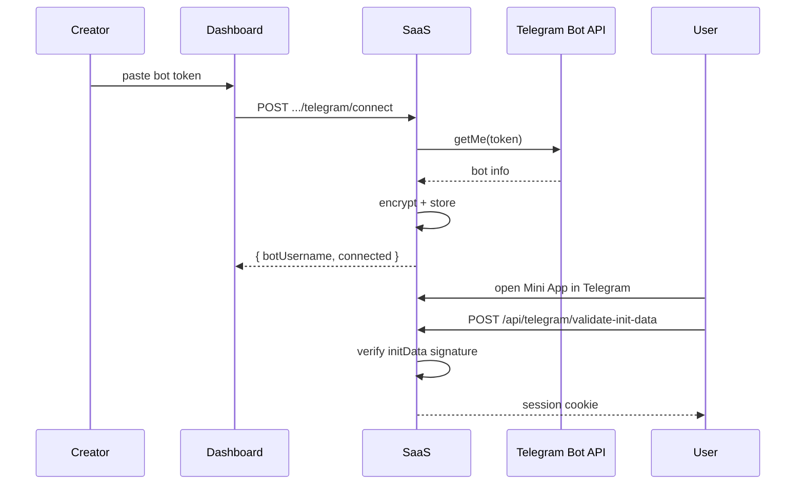

# Интеграция Telegram Bot

Подключение per-creator Telegram bot, валидация, хранение token.

---

## Обзор

- Creator подключает **свой** bot token **только** если выбрана surface `telegram_mini_app`
- SaaS API валидирует token через Telegram Bot API (`getMe`)
- Token **шифруется** и хранится server-side — **никогда** не возвращается frontend
- End-user auth в Mini App: `initData` validation

---

## Dashboard endpoints

Prefix: `/api/dashboard/tenants/{tenantId}/telegram`

| Method | Path | Body | Response |
|--------|------|------|----------|
| POST | `/connect` | `{ token: string }` | `TelegramIntegrationStatusResponse` (botUsername, status) |
| POST | `/disconnect` | `{ integrationId?: string }` | status |
| POST | `/validate` | `{ token: string }` | `ValidateTelegramBotResponse` (без сохранения) |
| GET | `/status` | — | current integration status |

**Response never includes:** raw bot token, `external_token`.

---

## End-user auth

| Method | Path | Body | Response |
|--------|------|------|----------|
| POST | `/api/telegram/validate-init-data` | `{ tenantSlug, initData }` | `{ user: EndUserSummary }` + end-user session cookie |

Dev bypass: `ALLOW_DEV_TELEGRAM_AUTH=true` (только development).

---

## Webhook

```
POST /api/telegram/webhook/{integrationId}
```

**Current state:** placeholder — returns `{ ok: true, integrationId }` without processing payload. Document for future webhook handling.

---

## Environment variables

| Variable | Scope | Назначение |
|----------|-------|------------|
| `TELEGRAM_BOT_TOKEN` | SaaS API | Platform/dev fallback bot (optional in dev) |
| `TELEGRAM_BOT_SETUP_MODE` | SaaS API | `mock` \| `remote` — bot connect behavior |
| `TELEGRAM_TOKEN_ENCRYPTION_KEY` | SaaS API | AES key for encrypting stored creator tokens |
| `ALLOW_DEV_TELEGRAM_AUTH` | SaaS API | Bypass initData validation locally |

---

## Setup modes

| Mode | Behavior |
|------|----------|
| `mock` | Connect accepts test tokens; no real Telegram API call |
| `remote` | Real `getMe` validation via Telegram Bot API |

---

## Security rules

1. Frontend sends token **only** on connect/validate — SaaS stores encrypted ref
2. Subsequent status calls return bot username + connection state only
3. Token encryption key must be set in staging/production
4. `ALLOW_DEV_TELEGRAM_AUTH=false` in production/staging

---

## Flow diagram



---

## Связанные документы

- [CREATOR_DASHBOARD.md](./CREATOR_DASHBOARD.md)
- [ENVIRONMENT_VARIABLES.md](./ENVIRONMENT_VARIABLES.md)
- [FRONTEND_BACKEND_CONNECTION.md](./FRONTEND_BACKEND_CONNECTION.md)
